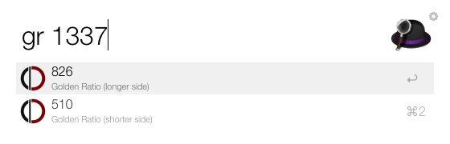

# GoldenRatio Workflow for Alfred 2 

This workflow calculates the longer and shorter side of the golden ratio for any given number.

## Install

Download the workflow (), then open it to install.

## Usage

Use the keyword 'g'’ followed by an integer to get the corresponding shorter and longer side of the golden ratio which then can be selected and copied to the clipboard pressing 'Enter'.

## Contributing

1. Fork this repository.
2. Add your feature.
3. Pull requests welcome! :)
